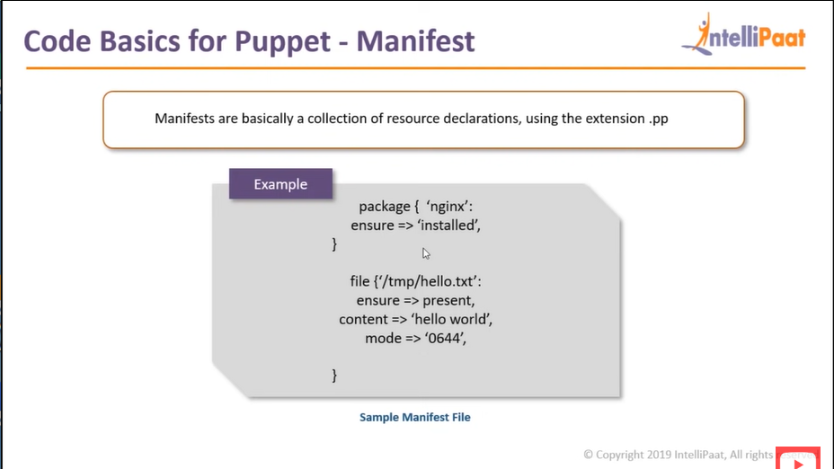
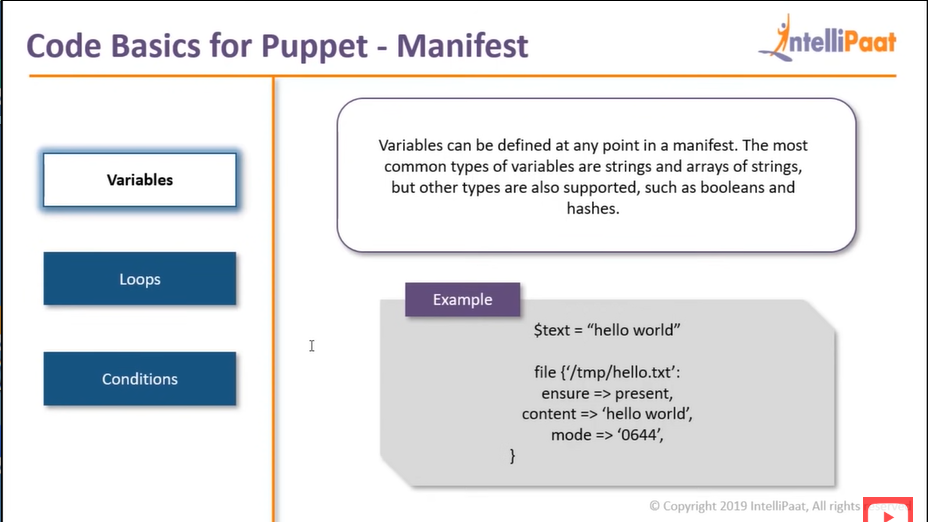

What are Chef and Puppet

Chef, the configuration management tool makes automation possible across several devices and servers with not many steps to follow. It uses a declarative approach to coding and hence removes the demand of creating pages of codes. Just in few clicks one can deploy as well as manage all the software applications in all devices across the business. This makes life easy as there is no need for professionals to know hardcore coding. One can kick start a career with minimal knowledge in coding. That is the power of this automation tool. The only requirement to start with the chef is to know Ruby DSL language basics which will also be taught in every DevOps online course.

Puppet centralizes and automates the configuration management process within no time. It is available in an open-source version allowing anyone to learn and make use of it. Puppet will individually configure each host and monitors continuously all the configurations. Yes, irrespective of the number of servers puppet does it easily. Further, it has control over many infrastructures and is used for deploying several applications in servers automatically.  Puppet also uses declarative-specific language (DSL) and defines the attributes of each environment.

comparison on chef and puppet 

installing puppet 
create 2 instances one for puppet master and the other for slave 

select the ubuntu ami 
t2 micro
no of instances 2
security group
all tcp connection with ip address of slave but lets do all connections for now 
commands to install  puppet on instances 

on master:
sudo apt-get update 
sudo apt-get install wget
wget https://apt.puppetlabs.com/puppet-release-bionic.deb
sudo dpkg -i puppet-release-bionic.deb
sudo apt-get install puppetmaster
apt policy puppetmaster
sudo systemctl status puppet-master.service
vim /etc/default/puppet-master
  -- JAVA_ARGS="-Xms512m -Xmx512m" ---specifing memory
sudo systemctl restart puppet-master.service

sudo ufw allow 8140/tcp for communications to update rules

//Change code
sudo mkdir -p /etc/puppet/code/environments/production/manifests/
sudo nano /etc/puppet/code/environments/production/manifests/site.pp

file {'/tmp/it_works.txt':           #resource type file and filename 
 ensure => present,                   #make sure it exists
 mode => '0644',                      #file permissions
 content => "it works on ${ipaddress_eth0}!\n", # print the eth0 IP fact
}

sudo systemctl restart puppet-master

//puppet Agent or slave
sudo apt-get update
sudo apt-get install wget 
wget https://apt.puppetlabs.com/puppet-release-bionic.deb
sudo dpkg -i puppet-release-bionic.deb
sudo apt-get install puppet

change the host file before restarting 
sudo systemctl start puppet
sudo systemctl enable puppet 

//change host file
 sudo nano /etc/hosts
 on both machines  
 specify the ip address of the master in the slave and master 

 --ip address of master and write  puppet beside it 

//searching for certificates sent to the master 
sudo puppet cert list 

//on Puppet Master
sudo puppet cert sign --all
iff more than one add --all 

after //Change code
//on Puppet Agent
sudo puppet agent --test

manifest specify what changes have been made on the slave 

code basics for puppet 

 implementation of manifest -

installing apache 
cd /etc/puppet
cd code
sudo mkdir -p environments/production/manifests
cd into 
sudo nano site.pp
node defaullt{
package{'nginx':
ensure=>installed,
    }
file {'/tmp/status.txt':
content=>'Nginx Installed',
mode=>'0644',
 }
}
save it 
go to your slave and type
 sudo puppet agent --test
cat /tmp/status.txt

3 components of manifest 
variables to store values 

to purge nginx 
sudo apt-get purge nginx 
sudo servivce nginx stop 
